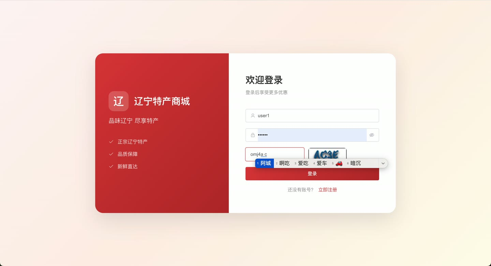
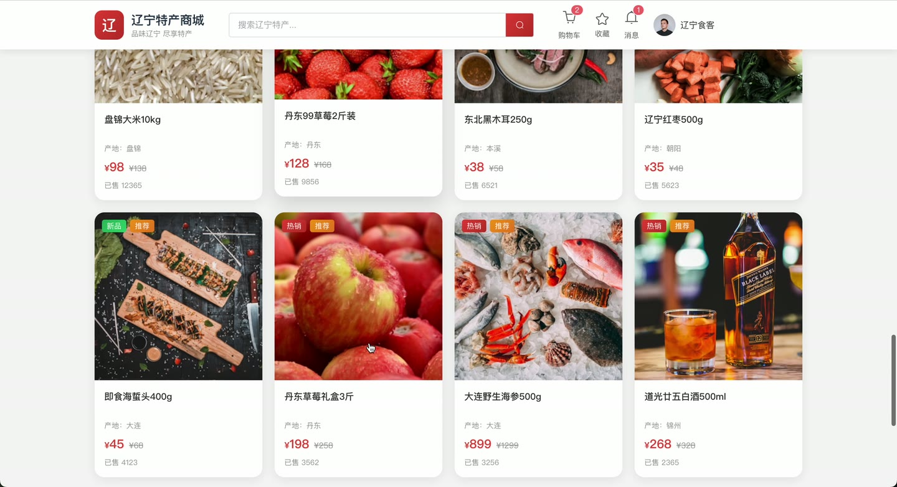
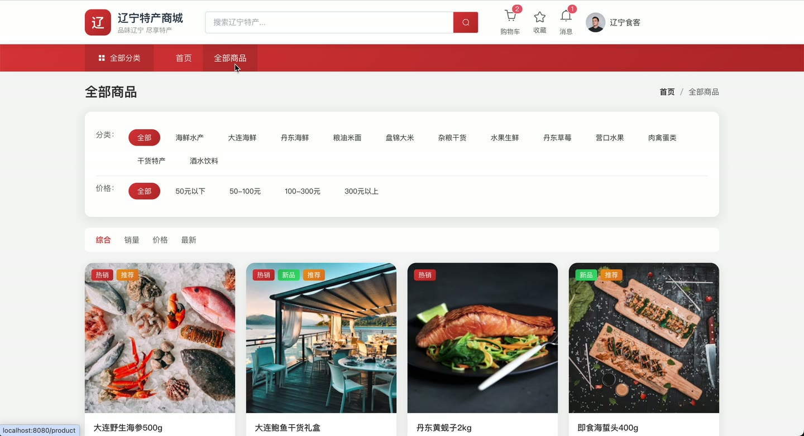
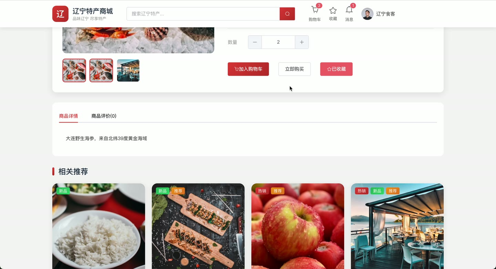
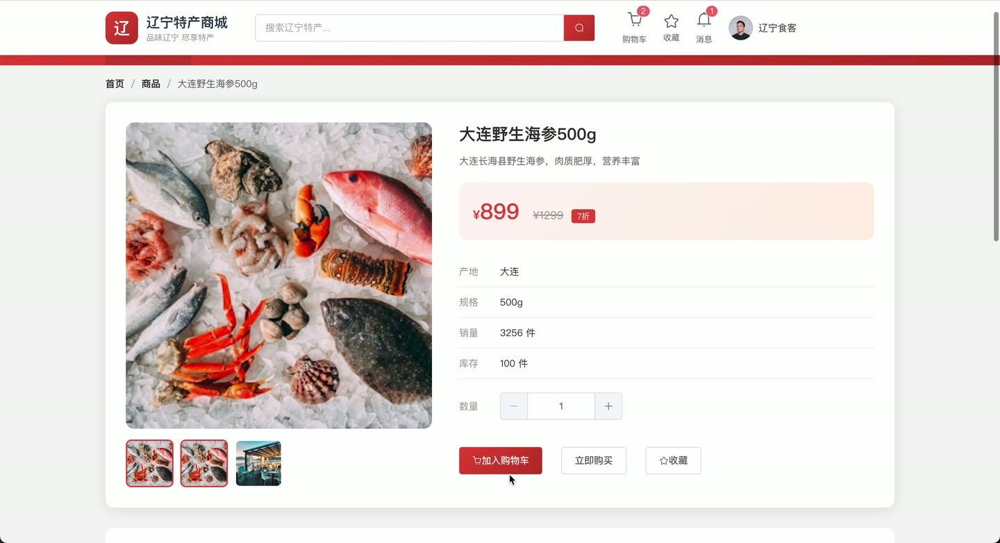
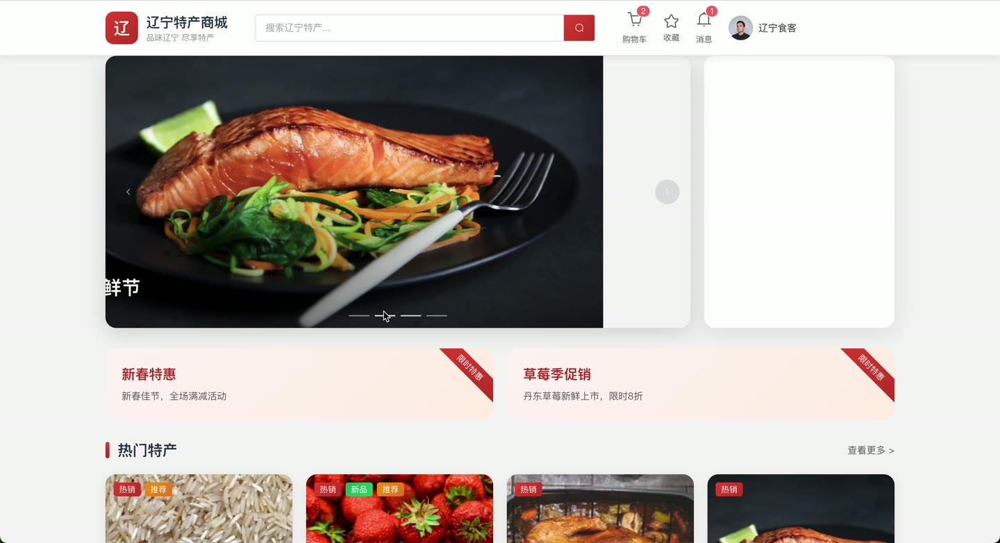

# (附文档)Springboot3+Vue3+MySQL 辽宁特产销售系统

**技术栈**：Springboot3、Vue3、MySQL

### 辽宁特产销售系统
 
### 系统简介

辽宁特产销售系统是一套基于 Spring Boot 3 + Vue 3 前后端分离架构的电商平台，支持普通用户端和管理员端双角色。系统提供商品浏览、购物车、订单管理、优惠券、站内消息、客服咨询等完整电商功能，并内置后台数据统计看板，适用于地方特产在线销售场景。
 
### 核心功能
 
### 普通用户端

 
- 注册与登录：通过验证码完成注册，登录后获取用户信息（昵称、头像、手机、邮箱、性别），支持退出登录 
- 首页浏览：查看轮播图、商品分类（含城市分类树）、热销/新品/推荐商品列表、促销活动信息 
- 商品搜索与筛选：按分类、关键词、价格区间、城市、排序方式（销量/价格/时间）分页搜索商品 
- 商品详情：查看商品主图、名称、价格、库存、描述、用户评价列表及平均评分，浏览时自动记录足迹 
- 购物车管理：添加商品到购物车、修改数量、勾选/取消勾选、全选/取消全选、批量删除、查看购物车商品数量 
- 下单结算：选择收货地址、使用优惠券（满减/折扣）、填写备注，从购物车勾选商品创建订单 
- 订单管理：查看订单列表（按状态筛选：待付款/待发货/待收货/已完成/已取消/退款中）、查看订单详情、支付订单（选择支付方式）、取消订单、确认收货、申请退款 
- 商品收藏：收藏/取消收藏商品，分页查看收藏列表 
- 商品评价：对已购商品发表评价（评分+内容），支持批量评价 
- 收货地址管理：新增/编辑/删除地址，设置默认地址 
- 个人资料修改：更新昵称、头像、手机、邮箱、性别 
- 密码修改：输入原密码和新密码完成密码变更 
- 浏览历史：分页查看浏览过的商品，支持一键清空历史记录 
- 站内消息：查看消息列表（按已读/未读筛选）、标记单条/全部已读、删除消息、查看未读消息数量 
- 优惠券：查看可用/已用/已过期优惠券列表，领取平台发放的优惠券 
- 客服咨询：提交咨询内容（关联商品），查看历史咨询及回复 
- 文件上传：上传单张或多张图片，返回图片访问路径
 
### 管理员端

 
- 仪表盘：查看今日销售额、今日订单数、总用户数、总商品数、近7天销售趋势曲线、热销商品Top5 
- 商品管理：分页查看商品列表（按分类/关键词/状态筛选）、新增/编辑/删除商品、修改商品上下架状态、修改库存 
- 商品分类管理：查看分类列表及树形结构、新增/编辑/删除分类 
- 订单管理：分页查看订单列表（按订单号/状态/日期范围筛选）、查看订单详情、发货（填写快递公司和单号）、审核退款申请（通过/拒绝） 
- 用户管理：分页查看用户列表（按关键词搜索）、查看用户详情、启用/禁用用户、修改用户角色、删除用户 
- 轮播图管理：查看轮播图列表、新增/编辑/删除轮播图 
- 优惠券管理：分页查看优惠券列表（按状态筛选）、新增/编辑/删除优惠券 
- 促销活动管理：分页查看促销列表（按状态筛选）、新增/编辑/删除促销活动 
- 评价管理：分页查看商品评价（按商品/评分筛选）、回复用户评价 
- 客服咨询管理：分页查看用户咨询（按状态筛选）、回复咨询内容 
- 数据统计：查看总销售额、订单数、用户数、商品数概览，查看销售趋势和热销商品排行
 
### 技术栈

  后端框架 Spring Boot 3.0   ORM MyBatis-Plus   权限验证 Session + 拦截器（UserContext）   前端框架 Vue 3   状态管理 Pinia   构建工具 Vite   数据库 MySQL 8.0   验证码 Kaptcha   工具库 Hutool、Lombok 
 
### 交付内容

 
- 后端完整源码 
- 前端完整源码 
- 数据库初始化脚本 
- 万字文档

## 界面展示

---

## 获取完整源码 + 万字文档

本仓库为项目介绍页。**完整前后端源码、数据库初始化脚本、万字项目文档**，请加微信 `kangkangcode`，或访问 [codekk.top](http://codekk.top) 获取。

可作课程设计 / 毕业设计参考，支持远程部署调试。